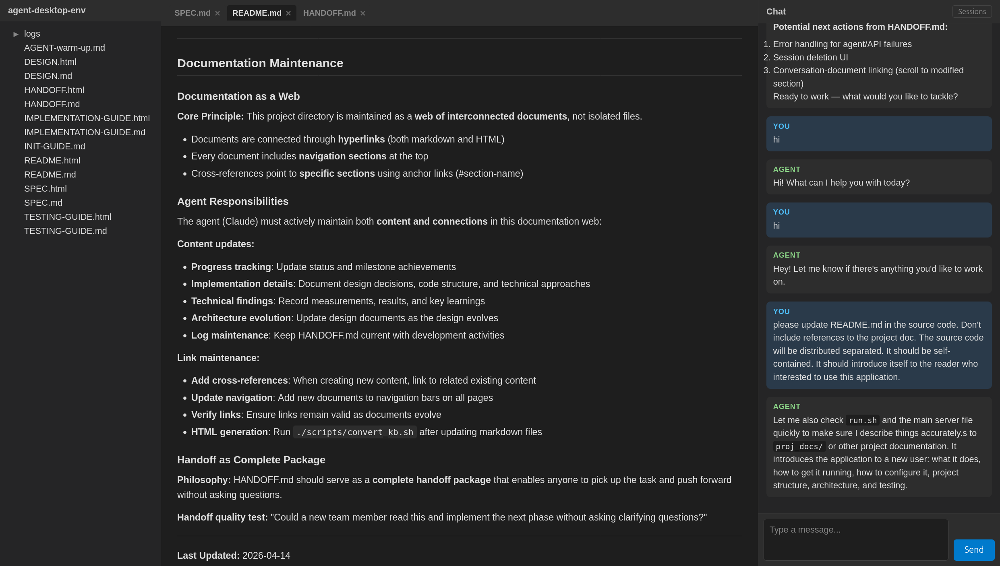

# Agent Desktop Environment

A web application that puts an AI coding agent and your project documents side by side. Browse files, view rendered markdown, and chat with a Claude-powered agent — all in one window, with real-time updates as files change.



## What It Does

- **Three-panel layout** — file tree on the left, document viewer in the center, chat on the right
- **Live document rendering** — open markdown files as tabs; they re-render automatically when saved (works with any editor, git operations, or the agent itself)
- **Integrated chat** — converse with a Claude Code agent that has full access to your project (file I/O, shell commands, etc.)
- **Annotation** — select text in a document and it's attached as context to your next message, so the agent knows exactly what you're pointing at
- **Session persistence** — conversations are saved and resumed automatically; workspace state (open tabs, scroll positions) survives page reloads

## Requirements

- Python 3.10+
- [Claude Code](https://docs.anthropic.com/en/docs/claude-code) CLI installed and available on `PATH`
- Linux (file watching uses inotify)

## Quick Start

```bash
./run.sh /path/to/your/project
```

This sets up a virtualenv, installs Python dependencies, and starts the server at **http://localhost:9800**. Open that URL in your browser.

The project directory can also be set via `ADE_PROJECT_DIR`:

```bash
ADE_PROJECT_DIR=/path/to/your/project ./run.sh
```

If no project directory is specified, a built-in default is used.

## Configuration

| Variable | Default | Description |
|----------|---------|-------------|
| `ADE_PROJECT_DIR` | — | Root directory shown in the file tree and watched for changes |
| `ADE_PORT` | `9800` | Port the server listens on |
| `ADE_INIT_FILE` | `AGENT-warm-up.md` | File the agent reads at the start of each new session for project context. Set to an empty string to disable. |

### Agent Warm-Up

When a new chat session starts, the agent automatically reads the file specified by `ADE_INIT_FILE` (relative to the project directory). This lets you give the agent background on your project — architecture, conventions, current status — so it's productive from the first message. Create an `AGENT-warm-up.md` in your project root, or point `ADE_INIT_FILE` to any file you prefer.

## Project Structure

```
.
├── run.sh                  # Entry point — venv setup + server launch
├── requirements.txt        # Python dependencies
├── server/                 # FastAPI backend
│   ├── main.py             # App setup, routes, WebSocket, lifespan
│   ├── agent.py            # Claude Code CLI subprocess management
│   ├── session.py          # Session persistence (JSON files)
│   ├── file_watcher.py     # inotify filesystem watcher (watchfiles)
│   └── websocket.py        # WebSocket connection manager
├── static/                 # Frontend (vanilla HTML/CSS/JS, no build step)
│   ├── index.html          # Three-panel layout
│   ├── css/style.css       # Dark-themed styles
│   └── js/
│       ├── app.js          # Init, WebSocket, workspace restore
│       ├── filetree.js     # File tree panel
│       ├── document.js     # Document viewer — tabs, rendering, scroll
│       ├── chat.js         # Chat — messaging, streaming, annotations, sessions
│       └── marked.min.js   # Markdown parser (vendored)
├── tests/                  # Test suite (58 tests)
└── sessions/               # Saved session files (auto-created)
```

## Architecture

- **Backend:** FastAPI serves static files, a REST API for the file tree, and a single multiplexed WebSocket for real-time communication (file events, chat messages, eval commands).
- **Frontend:** Vanilla JS modules with no framework and no build step. Markdown is rendered client-side with marked.js.
- **Agent:** Claude Code CLI runs as a subprocess with `--output-format stream-json --resume <session-id>`, giving it full tool access and multi-turn memory.
- **File watching:** `watchfiles` (inotify) detects saves and pushes updates over WebSocket. Handles atomic writes, debounces rapid events, and refreshes both the file tree and any open documents.

## Running Tests

```bash
source venv/bin/activate
pytest tests/
```

Some tests drive the UI via a WebSocket eval channel and require a running browser tab. Pass `--tab-id <id>` to target a specific tab.

## License

MIT
